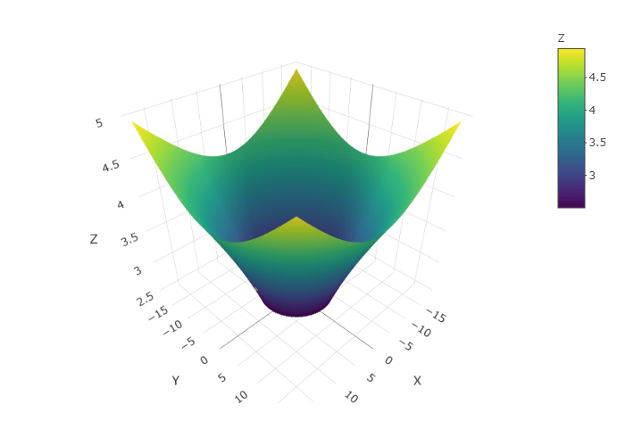

```{r setup, include=FALSE}
knitr::opts_chunk$set(interval = 0.001)
library(gifski)
library(tidyverse)
library(rgl)
library(plot3D)
library(knitr)
library(plotly)
options(rgl.useNULL = TRUE)
```

Here we will try to simulate the motion of a ball on a friction-less gravity well of a particular shape with **Runge-Kutta Method**. We will first figure out the equations of motion and then will code them.

*All Plots on this page are interactive.*

### OBJECTIVE

Consider a funnel-like surface obtained by rotating the curve $z = F(y)$ about Z-axis, where $F(y) = \sqrt{y - 1}$.

```{r funnel_plot, echo=FALSE, warning=FALSE}
g = 9.8

u = function(x, y) sqrt(x^2+y^2)
f = function(x, y) sqrt(u(x,y) - 1)
f.dash = function(x, y) 1/(2*sqrt(u(x,y) - 1))

X = seq(-23, 23, 0.1)
Y = seq(-23, 23, 0.1)
z.matrix <- matrix(rep(0, length(X)*length(Y)), length(X))

for (i in 1:length(X)) {
  for (j in 1:length(Y)) {
    z.matrix[i, j] <- f(X[i], Y[j])
  }
}

z.matrix[is.na(z.matrix)] <- 0

for (i in 1:length(X)) {
  for (j in 1:length(Y)) {
    if(z.matrix[i, j] < 2.5 | z.matrix[i, j] == 0)
      z.matrix[i, j] = NA
  }
}

Z <- z.matrix
p1 <- plot_ly(source = "plot1") %>%
  add_surface(x = ~X, y = ~Y, z = ~Z) %>%
  add_markers(x = ~c(10), y = ~c(0), z = ~c(f(10, 0)))
p1
```

Now we release the ball from $x_0 = 10$, $y_0=0$ with initial velocities as $v_{x_0} = 0$, $v_{y_0} = 5$.

Simulate the motion of the ball on this friction-less surface. We shall ignore the radius of the ball while doing the calculations.

### EQUATIONS OF MOTION

After all the relevant calculations the final Equations of Motion which we get are -

$$
x'' = -x.R = f(x,y,v_x,v_y)
$$

$$
y'' = -y.R = g(x,y,v_x,v_y)
$$

where,

$$
R = \frac{F'(u).(x'^2+y'^2-u'^2)/u\ +\ u'^2.F''(u)\ +\ g}{u.(F'(u) + 1/F'(u))}
$$

$$
u = \sqrt{x^2+y^2}
$$

$$
g = 9.8\ m/s^2
$$

and $v_x$ and $v_y$ are the velocities in the $x$ and $y$ directions respectively.

We use the 4th Order Runge-Kutta Method to find out the velocity and displacement at the instant $t$.

The intermediate expressions resulting from the Runge-Kutta Method to find the updated position at $t+dt$ time are

$$
t_i = t_{i-1} + dt
$$

$$
k_1 = h.v_{x[i-1]} \\
j_1 = h.v_{y[i-1]} \\
l_1 = h.f(x_{i-1}, y_{i-1}, v_{x[i-1]}, v_{y[i-1]}) \\
m_1 = h.g(x_{i-1}, y_{i-1}, v_{x[i-1]}, v_{y[i-1]}) \\ \\
k_2 = h.(v_{x[i-1]} + \frac{l_1}{2})\\
j_2 = h.(v_{y[i-1]} + \frac{m1}{2})\\
l_2 = h.f(x_{i-1}+\frac{k_1}{2}, y_{i-1}+\frac{j_1}{2}, v_{x[i-1]}+\frac{l_1}{2}, v_{y[i-1]}+\frac{m_1}{2}) \\
m_2 = h.g(x_{i-1}+\frac{k_1}{2}, y_{i-1}+\frac{j_1}{2}, v_{x[i-1]}+\frac{l_1}{2}, v_{y[i-1]}+\frac{m_1}{2}) \\
k_3 = h.(v_{x[i-1]} + \frac{l2}{2}) \\
j_3 = h.(v_{y[i-1]} + \frac{m2}{2}) \\
l_3 = h.f(x_{i-1}+\frac{k_2}{2}, y_{i-1}+\frac{j_2}{2}, v_{x[i-1]}+\frac{l_2}{2}, v_{y[i-1]}+\frac{m_2}{2}) \\
m3 = h.g(x_{i-1}+\frac{k_2}{2}, y_{i-1}+\frac{j_2}{2}, v_{x[i-1]}+\frac{l_2}{2}, v_{y[i-1]}+\frac{m_2}{2}) \\
k_4 = h.(v_{x[i-1]} + l_3) \\
j_4 = h.(v_{y[i-1]} + m_3) \\
l_4 = h.f(x_{i-1}+k_3, y_{i-1}+j_3, v_{x[i-1]}+l_3, v_{y[i-1]}+m_3) \\
m_4 = h.g(x_{i-1}+k_3, y_{i-1}+j_3, v_{x[i-1]}+l_3, v_{y[i-1]}+m_3)
$$

Finally we use these values to update the values of $x,\ y,\ v_x,\ v_y$.

$$
v_{x[i]} = v_{x[i-1]} + \frac{l_1 + 2.l_2 + 2.l_3 + l_4}{6} \\
v_{y[i]} = v_{y[i-1]} + \frac{m_1 + 2.m_2 + 2.m_3 + m_4}{6} \\
x_i = x_{i-1} + \frac{k_1 + 2.k_2 + 2.k_3 + k_4}{6} \\
y_i = y_{i-1} + \frac{j_1 + 2.j_2 + 2.j_3 + j_4}{6} \\
z_i = F(x_i, y_i) 
$$

For the detailed calculation check this Link [Gravity Well](https://arnabc74.github.io/numana2021/diff1.html#gw)

### SIMULATION CODE & RESULTS

-   The above expressions are written in functions below

```{r}
g = 9.8

u = function(x, y) sqrt(x^2+y^2)
f = function(x, y) sqrt(u(x,y) - 1)
f.dash = function(x, y) 1/(2*sqrt(u(x,y) - 1))
R. <- function(x, y, vx, vy) ( ( f.dash(x, y) * (vx^2 + vy^2 - ((x*vx+y*vy)/u(x,y))^2 ) / u(x,y) ) + (((x*vx+y*vy)/u(x,y))^2)*(-1/(4*(u(x,y)-1)^1.5)) + g)/((u(x,y))*(f.dash(x, y) + (1/f.dash(x, y))))
a.x <- function(x, y, vx, vy) -x*R.(x, y, vx, vy)
a.y <- function(x, y, vx, vy) -y*R.(x, y, vx, vy)
```

-   The Following Function implements the Runge-Kutta Method to find out the motion of the Ball.

```{r gwell_function}
gravity.well = function(t0, x0, y0, vx0, vy0, n, dt){
  x = rep(0, n)
  y = rep(0, n)
  z = rep(0, n)
  t = rep(0, n)
  vx = rep(0,n)
  vy = rep(0,n)
  # ax = rep(0,n)
  # ay = rep(0,n)
  
  x[1] = x0
  y[1] = y0
  z[1] = f(x[1], y[1])
  t[1] = t0
  vx[1] = vx0
  vy[1] = vy0
  # ax[1] = 0
  # ay[1] = 0
  h <- dt
  
  for (i in 2:n) {
    t[i] = t[i-1] + dt
    k1 <- h*vx[i-1]
    j1 <- h*vy[i-1]
    l1 <- h*a.x(x[i-1], y[i-1], vx[i-1], vy[i-1])
    m1 <- h*a.y(x[i-1], y[i-1], vx[i-1], vy[i-1])
    k2 <- h*(vx[i-1] + l1/2)
    j2 <- h*(vy[i-1] + m1/2)
    l2 <- h*a.x(x[i-1] + k1/2, y[i-1] + j1/2, vx[i-1] + l1/2, vy[i-1] + m1/2)
    m2 <- h*a.y(x[i-1] + k1/2, y[i-1] + j1/2, vx[i-1] + l1/2, vy[i-1] + m1/2)
    k3 <- h*(vx[i-1] + l2/2)
    j3 <- h*(vy[i-1] + m2/2)
    l3 <- h*a.x(x[i-1] + k2/2, y[i-1] + j2/2, vx[i-1] + l2/2, vy[i-1] + m2/2)
    m3 <- h*a.y(x[i-1] + k2/2, y[i-1] + j2/2, vx[i-1] + l2/2, vy[i-1] + m2/2)
    k4 <- h*(vx[i-1] + l3)
    j4 <- h*(vy[i-1] + m3)
    l4 <- h*a.x(x[i-1] + k3, y[i-1] + j3, vx[i-1] + l3, vy[i-1] + m3)
    m4 <- h*a.y(x[i-1] + k3, y[i-1] + j3, vx[i-1] + l3, vy[i-1] + m3)
    
    vx[i] = vx[i-1] + (l1 + 2*l2 + 2*l3 + l4)/6 
    vy[i] = vy[i-1] + (m1 + 2*m2 + 2*m3 + m4)/6
    x[i] = x[i-1] + (k1 + 2*k2 + 2*k3 + k4)/6
    y[i] = y[i-1] + (j1 + 2*j2 + 2*j3 + j4)/6
    z[i] = f(x[i], y[i])
    
    # Sys.sleep(0.01)
  }
  
  X = seq(-18, 18, 0.1)
  Y = seq(-18, 18, 0.1)
  z.matrix <- matrix(rep(0, length(X)*length(Y)), length(X))
  
  for (i in 1:length(X)) {
    for (j in 1:length(Y)) {
      z.matrix[i, j] <- f(X[i], Y[j])
    }
  }
  
  z.matrix[is.na(z.matrix)] <- 0
  
  for (i in 1:length(X)) {
    for (j in 1:length(Y)) {
      if(z.matrix[i, j] < 2.5 | z.matrix[i, j] == 0)
        z.matrix[i, j] = NA
    }
  }
  Z <- z.matrix
  
  # Plotting
  p <- plot_ly(source = "plot2") %>%
    add_surface(x = ~X, y = ~Y, z = ~Z) %>%
    add_markers(x = ~x, y = ~y, z = ~z, opacity = 0.8, color = c("red"), size = 0.5)
  return(p)
  
}
```

Now, Let's see what is the trajectory path with the given initial values.

```{r run_gwell, warning=FALSE, message=FALSE}
result <- gravity.well(0, 10, 0, 0, 5, 50000, 0.01)
result
```

The results are much better compared to the Taylor's Method. The trajectory is more symmetric and does not deflect much from it's path which was seen in Taylor's Method Trajectory.


