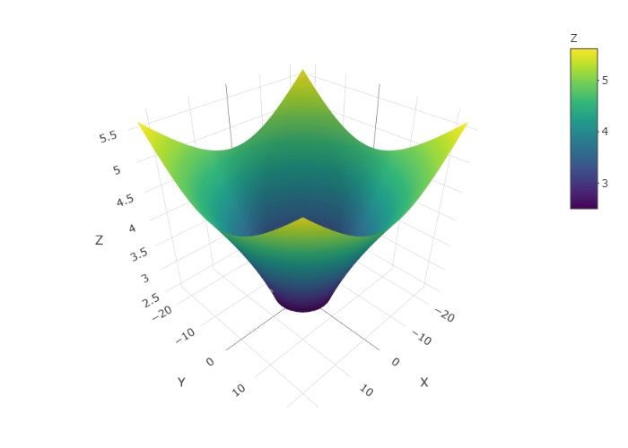

```{r setup, include=FALSE}
knitr::opts_chunk$set(interval = 0.001)
library(gifski)
library(tidyverse)
library(rgl)
library(plot3D)
library(knitr)
library(plotly)
options(rgl.useNULL = TRUE)
```

# GRAVITY WELL SIMULATION (TAYLOR)

Here we will try to simulate the motion of a ball on a friction-less gravity well of a particular shape with **Taylor's Method**. We will first figure out the equations of motion and then will code them.

*All Plots on this page are interactive.*

### OBJECTIVE

Consider a funnel-like surface obtained by rotating the curve $z = f(y)$ about Z-axis, where $f(y) = \sqrt{y - 1}$.

```{r funnel_plot, echo=FALSE, warning=FALSE}
g = 9.8

u = function(x, y) sqrt(x^2+y^2)
f = function(x, y) sqrt(u(x,y) - 1)
f.dash = function(x, y) 1/(2*sqrt(u(x,y) - 1))

X = seq(-23, 23, 0.1)
Y = seq(-23, 23, 0.1)
z.matrix <- matrix(rep(0, length(X)*length(Y)), length(X))

for (i in 1:length(X)) {
  for (j in 1:length(Y)) {
    z.matrix[i, j] <- f(X[i], Y[j])
  }
}

z.matrix[is.na(z.matrix)] <- 0

for (i in 1:length(X)) {
  for (j in 1:length(Y)) {
    if(z.matrix[i, j] < 2.5 | z.matrix[i, j] == 0)
      z.matrix[i, j] = NA
  }
}

Z <- z.matrix
p1 <- plot_ly(source = "plot1") %>%
  add_surface(x = ~X, y = ~Y, z = ~Z) %>%
  add_markers(x = ~c(10), y = ~c(0), z = ~c(f(10, 0)))
p1
```

Now we release the ball from $x_0 = 10$, $y_0=0$ with initial velocities as $v_{x_0} = 0$, $v_{y_0} = 5$.

Simulate the motion of the ball on this friction-less surface. We shall ignore the radius of the ball while doing the calculations.

### EQUATIONS OF MOTION

After all the relevant calculations the final Equations of Motion which we get are -

$$
x'' = -x.R
$$

$$
y'' = -y.R
$$

where,

$$
R = \frac{f'(u).(x'^2+y'^2-u'^2)/u\ +\ u'^2.f''(u)\ +\ g}{u.(f'(u) + 1/f'(u))}
$$

$$
u = \sqrt{x^2+y^2}
$$

$$
g = 9.8\ m/s^2
$$

We use the Taylor's Method to find out the velocity and displacement at the instant t.

For the detailed calculation check this Link [Gravity Well](https://arnabc74.github.io/numana2021/diff1.html#gw)

### SIMULATION CODE & RESULTS

-   The Following Function implements the Taylor's Method to find out the motion of the Ball.

```{r gwell_function}
gravity.well = function(t0, x0, y0, vx0, vy0, n, dt){
  x = rep(0, n)
  y = rep(0, n)
  z = rep(0, n)
  t = rep(0, n)
  vx = rep(0,n)
  vy = rep(0,n)
  ax = rep(0,n)
  ay = rep(0,n)
  
  x[1] = x0
  y[1] = y0
  z[1] = f(x[1], y[1])
  t[1] = t0
  vx[1] = vx0
  vy[1] = vy0
  ax[1] = 0
  ay[1] = 0
  
  
  for (i in 2:n) {
    t[i] = t[i-1] + dt
    R = ( ( f.dash(x[i-1], y[i-1]) * (vx[i-1]^2 + vy[i-1]^2 - ((x[i-1]*vx[i-1]+y[i-1]*vy[i-1])/u(x[i-1],y[i-1]))^2 ) / u(x[i-1],y[i-1]) ) + (((x[i-1]*vx[i-1]+y[i-1]*vy[i-1])/u(x[i-1],y[i-1]))^2)*(-1/(4*(u(x[i-1],y[i-1])-1)^1.5)) + g)/((u(x[i-1],y[i-1]))*(f.dash(x[i-1], y[i-1]) + (1/f.dash(x[i-1], y[i-1])))) 
    ax[i] = -x[i-1]*R
    ay[i] = -y[i-1]*R
    vx[i] = vx[i-1] + ax[i-1]*dt 
    vy[i] = vy[i-1] + ay[i-1]*dt
    x[i] = x[i-1] + vx[i-1]*dt + ax[i-1]*(dt^2)/2
    y[i] = y[i-1] + vy[i-1]*dt + ay[i-1]*(dt^2)/2
    z[i] = f(x[i], y[i])
    
  }
  
  X = seq(-23, 23, 0.1)
  Y = seq(-23, 23, 0.1)
  z.matrix <- matrix(rep(0, length(X)*length(Y)), length(X))
  
  for (i in 1:length(X)) {
    for (j in 1:length(Y)) {
      z.matrix[i, j] <- f(X[i], Y[j])
    }
  }
  
  z.matrix[is.na(z.matrix)] <- 0
  
  for (i in 1:length(X)) {
    for (j in 1:length(Y)) {
      if(z.matrix[i, j] < 2.5 | z.matrix[i, j] == 0)
        z.matrix[i, j] = NA
    }
  }
  Z <- z.matrix
  
  # Plotting
  p <- plot_ly(source = "plot2") %>%
    add_surface(x = ~X, y = ~Y, z = ~Z) %>%
    add_markers(x = ~x, y = ~y, z = ~z, opacity = 0.8, color = c("red"), size = 0.5)
  return(p)
}
```

Now, Let's see what is the trajectory path with the given initial values.

```{r run_gwell, warning=FALSE, message=FALSE}
result <- gravity.well(0, 10, 0, 0, 5, 50000, 0.01)
result
```

A Small part of the above trajectory animated is shown below.


