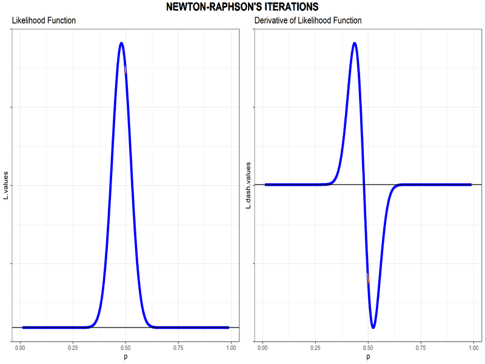

```{r setup, include=FALSE}
knitr::opts_chunk$set()
library(tidyverse)
library(ggpubr)
library(knitr)
```

# MAXIMUM LIKELIHOOD ESTIMATOR: BIO-STATISTICS

Here I will be implementing a code to find the maximum likelihood estimator numerically using techniques to solve non-linear equations numerically.

### OBJECTIVE

A certain trait in rabbits is controlled by a pair of alleles, $a$ and $A$. Each rabbit receives one of these from the father and another from the mother. Thus, the possible pairs are $aa$, $aA$ and $AA$ (order is immaterial). The probability that a parent gives an $a$ to the offspring is $p$ (unknown). So the probability of an $A$ is $q = 1-p$. The father's contribution is independent of the mother's, and so the probabilities of $aa$, $aA$ and $AA$ in the offspring are, respectively, $p^2$, $2pq$ and $q^2$. Our aim is to estimate $p$.Unfortunately, it is impossible to detect the pair an offspring has. It is only possible to detect if an offspring has at least one $A$, *i.e.*, whether $aa$ or $(aA, AA)$. The probabilities are, respectively, $p^2$ and $q^2+2pq$ In a random sample of 100 offsprings, only 23 are without any $A$. Find the Maximum Likelihood Estimator of $p$.

### LIKELIHOOD FUNCTION

Here as per the question in the Objective. To find the MLE for p we need to maximize the Likelihood function w.r.t. p. To do so we will be needing to find the critical points of the likelihood function $L(p)$. So we will be needing the derivative and double derivative of $L(p)$, as we require to find the roots of $L'(p)$ and we plan to use **Newton-Raphson Method** so we will also need $L''(p)$.

The probability of the event in Objective (Likelihood Function) is

$$
L(p)\ =\ p^{46}.(q^2\ +\ 2pq)^{77}
$$

where $p\in(0,1)$.

The derivatives are -

$$
L'(p)\ =\ 46.p^{45}(q^2 + 2pq)^{77} - 154.p^{47}(q^2 + 2pq)^{76}
$$

$$
L''(p)\ =\ 46\times45.\frac{L(p)}{p}-154\times46.\frac{L(p)}{1-p^2} -154\times47.\frac{L(p)}{1-p^2} + 308\times76.p^2.\frac{L(p)}{(1-p^2)^2} 
$$

### FINDING MLE - CODE & RESULTS

The above equations are -

```{r math_eqns}
L = function(p) (p^46)*((1-p)^2 + 2*p*(1-p))^77

L.dash = function(p) (46*(p^45)*((1-p)^2 + 2*p*(1-p))^77) + ((p^46)*(77*((1-p)^2 + 2*p*(1-p))^76)*(-2*p))

L.ddash = function(p) (46*45*L(p)/p) + ((-2*46*77)*L(p)/(1-p^2)) + ((-2*77*47)*L(p)/(1-p^2)) + ((2*2*77*76)*(p^2)*(L(p)/((1-p^2)^2)))
```

Before any sort of finding the roots it's always better to look at the graphs of the functions.

```{r Plots, fig.width=12, fig.asp=0.618}
function_plots <- tibble(p = seq(0.01, 0.99, 0.001)) %>%
  mutate(L.values = L(p), L.dash.values = L.dash(p))

p1 <- function_plots %>%
  ggplot(aes(p, L.values)) +
  geom_line(size = 2, color = "blue") +
  geom_hline(yintercept = 0) +
  ggtitle("Likelihood Function") +
  theme_bw() +
  scale_y_continuous(labels = NULL)

p2 <- function_plots %>%
  ggplot(aes(p, L.dash.values)) +
  geom_line(size = 2, color = "blue") +
  geom_hline(yintercept = 0) +
  ggtitle("Derivative of Likelihood Function") +
  theme_bw() +
  scale_y_continuous(labels = NULL) 

annotate_figure(ggarrange(p1, p2, ncol = 2), top = text_grob("OBJECTIVE FUNCTIONS", face = "bold", size = 16))
```

Here I will be first using Newton-Raphson's Method to find the roots of $L'(p)$.

```{r NR}
NR = function(f, d, x0, n){
  vals <- rep(0, n)
  x = x0
  for (i in 1:n) {
    (x = x - f(x)/d(x))
    vals[i] = x
  }
  return(vals)
}
```

Now, we will start the Newton-Raphson's Search with a guess of $p=0.5$ as we saw that the maxima occurs near that value.

```{r run_NR, warning=FALSE}
kable(tail(NR(L.dash, L.ddash, 0.5, 100)), align = 'l')
```



It seems our Newton-Raphson's Method has converged to a value of $p = 0.479\ (approx.)$. Evaluating $L'(0.479583) = -8.8\times 10^{-28}$, which seems pretty close to 0 and it is seems to be maxima as the plot of $L(p)$ shows maxima around this value.

```{r maximum_point, fig.width=12, fig.asp=0.618}
function_plots %>%
  ggplot(aes(p, L.values)) +
  geom_line(size = 2, color = "blue") +
  geom_hline(yintercept = 0) +
  geom_point(data = tibble(x = 0.479583, y = L(0.479583)), mapping = aes(x, y), size = 3, color = "red") +
  ggtitle("Likelihood Function - MLE for p") +
  theme_bw() +
  scale_y_continuous(labels = NULL)
```

Thus, the MLE for $p$ is approximately $0.479$.
