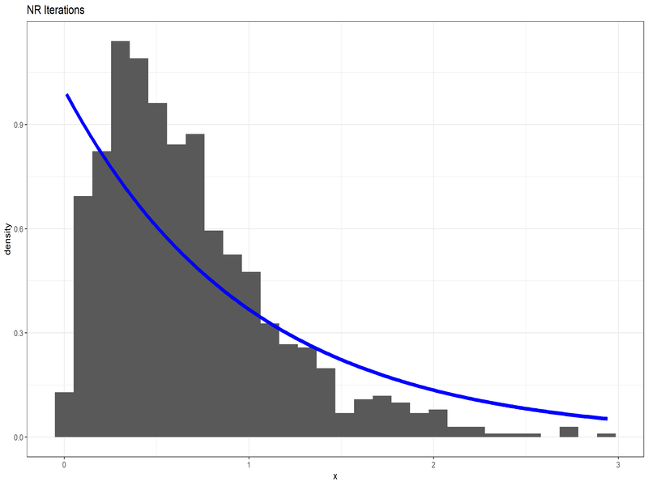

```{r setup, include=FALSE}
knitr::opts_chunk$set()
library(rio)
library(tidyverse)
library(knitr)
```

```{r raw_data, cache=TRUE, echo=FALSE}
data = import("data.csv")
n = 996
product = 1
summation = 0
datalist = numeric(996)
dataoutput = numeric(996)
k = 1

L = function(x, p, a) ((a^p)*(x^(p-1))*exp((-1)*a*x))/gamma(p)

for (i in 1:166) {
  for (j in 1:6) {
    product = product*data[i, j]
    summation = summation + data[i, j]
    datalist[k] = data[i, j]
    dataoutput[k] = L(datalist[k],1.946419, 2.878890)
    k = k+1
  }
}
```

Here we will implement a code to fit a distribution to a give data, where we will using techniques from non-linear equation solving which is used to find MLEs.

### OBJECTIVE

Fit a Gamma Distribution to the given data set using Maximum Likelihood Estimators. The first few values of Data looks like this -

```{r view_data, echo=FALSE}
kable(head(datalist), align = 'l')
```

### LIKELIHOOD FUNCTIONS

The density of the Gamma distribution is -

$$
f(x;p,a)\ =\ \frac{a^p}{\Gamma(p)}.x^{p-1}.e^{-ax}\ ;where\ x,\ p,\ a>0 
$$

The Likelihood Function is -

$$
L(p,a)\ =\ \prod_{i=1}^n f(x;p,a)
$$

where, $x_1,\dots, x_n$ are the data in the file.

Now, the Likelihood Function when evaluated results in really small values which results in numerically improper results. So, we will instead use Log-Likehood and it's derivatives.

$$
\frac{\partial \log(L)}{\partial p}\ =\ n.\log(a)\ +\ \log(\prod_{i=1}^n x_i) - n.\digamma(p)
$$

$$
\frac{\partial \log(L)}{\partial a}\ =\ n.\frac{p}{a}\ -\ \sum_{i=1}^n x_i
$$

The Jacobian Matrix for the above System of 2 Equations in 2 variables is -

$$
J\ =\ \begin{bmatrix}
-n.\frac{d^2\log(\Gamma(p))}{dp^2}&\frac{n}{a} \\
\frac{n}{a}&-n.\frac{p}{a^2} \\
\end{bmatrix}
$$

We now have all the tools necessary to implement the Newton-Raphson Method.

### FITTING THE DISTRIBUTION - CODE & RESULTS

Let's First have a look at the Histogram of the data -

```{r data_hist, fig.width=12, fig.asp=0.618}
data1 <- tibble(x = datalist)

data1 %>%
  ggplot(aes(x)) +
  geom_histogram(bins = 20) +
  theme_bw() +
  ggtitle("Histgram of the Data")
```

Let's implement the Newton-Raphson's Method to find the roots of the Log-Likelihood Function.

```{r equations}
L.dash = function(x){
  p = x[1]
  a = x[2]

  dellogL.delp = n*log(a) + log(product) - n*digamma(p)
  dellogL.dela = (n*p/a) - summation
  
  return(c(dellogL.delp, dellogL.dela))
}

J = function(x) {
  p = x[1]
  a = x[2]

  vec = c(-n*trigamma(p), n/a, n/a, -n*p/a^2)
  J <- matrix(data = vec, ncol = 2)
  return(J)
}
```

```{r NR2}
NR2 = function(f, d, x0, n){
  vals <- tibble(p = rep(0, n), a = rep(0, n))
  for (i in 1:n) {
    ( x0 = x0 - solve(d(x0), f(x0)) )
    vals[i, 1] <- x0[1]
    vals[i, 2] <- x0[2]
  }
  return(vals)
}

```

Now, Running the above function.

```{r run_NR2, warning=FALSE}
kable(tail(NR2(L.dash, J, c(1,1), 10)), align = 'l')
```

It seems our Function found a root at $p=1.946,\ a=2.878 (approx.)$.

Let's overlay the Gamma Distribution with these parameters on the Histogram to see how good the fit is.



```{r fitted_dist, fig.asp=0.7, fig.width=12}
tibble(x = datalist) %>%
  ggplot(aes(x, ..density..)) +
  geom_histogram(bins = 30) +
  geom_line(data = tibble(x = seq(min(datalist, na.rm = TRUE), max(datalist, na.rm = TRUE), 0.01), fit = dgamma(seq(min(datalist, na.rm = TRUE), max(datalist, na.rm = TRUE), 0.01), 1.946419, 2.878890)), aes(x, fit), size = 2, color = "blue") +
  theme_bw() +
  ggtitle("Gamma Distribution Fitted")
```

It seems like a decent fit visually!
