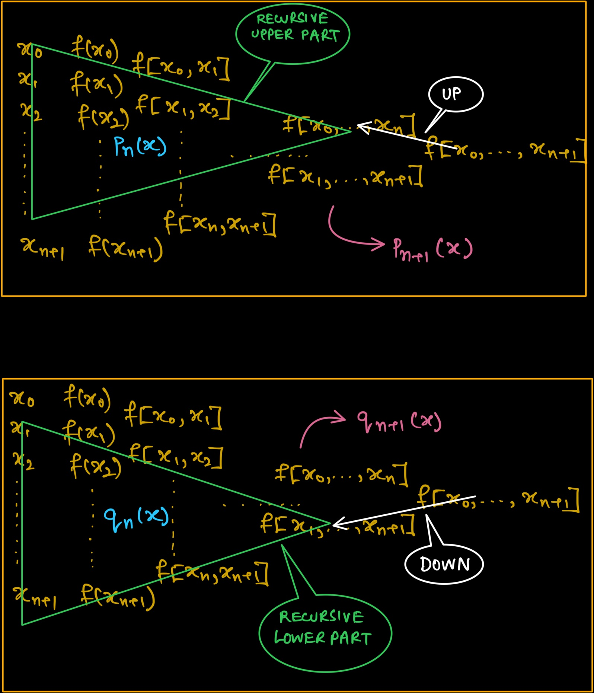

```{r setup, include=FALSE}
knitr::opts_chunk$set()
library(knitr)
```

We here set off to find prove the seemingly strange fact of us getting the same Interpolating Polynomial irrespective of the path we chose for finding out the Interpolating Polynomial in the Newton's Divided Difference Table.

### OBJECTIVE

Prove the Strange Fact of choosing any path leads to the same unique interpolating Polynomial rigorously.

### FACTS & RESULTS

Here we first present all the facts and results we know till now or which have been proved in other assignments and webpage.

1.  The divided difference $f[x_0,\ x_1,\ \dots,\ x_n]$ is Permutation Invariant.

2.  Newton's Forward Path gives us the unique Interpolating Polynomial through the points $(x_0,f(x_0)),\ (x_1,f(x_1))\ \dots,\ (x_n, f(x_n))$, i.e.

$$
f(x)\ =\ f[x_0]\ +\ (x-x_0).f[x_1,x_0]\ +\ (x-x_0)(x-x_1).f[x_2,x_1,x_0]\ +\ \dots\ +\ (x-x_0)\dots(x-x_{n-1}).f[x_n,\dots,x_0]
$$

3.  Newton's Fundamental Formula holds i.e. for any $f:\mathbf{R}\longrightarrow\mathbf{R}$ be any function and let $x_0,\ x_1,\ \dots,\ x_n$ be distinct real numbers. Then for any $x\in\mathbf{R}$,

$$
f(x)\ =\ p_n(x)\ +\ R_n(x).
$$

where $p_n$ is the unique polynomial of degree at most n that interpolates $f$ at $x_0,\ x_1,\ \dots,\ x_n$ , and the remainder term $R_n(x)$ is given by -

$$
R_n(x)\ =\ [\prod_{i=0}^n(x-x_i)].f[x,x_0,\dots,x_n]
$$

### PROOF

We see it is *enough to prove* that **any path leads to a Polynomial of degree** $\leq n$ that passes through all the points $(x_0,f(x_0)),\ (x_1,f(x_1))\ \dots,\ (x_n, f(x_n))$.

Because that would imply by *Newton's Fundamental Formula* that **this Polynomial is unique** and hence it is the *same as Newton's Forward Path* and we have already shown that *Newton's Forward Path is a Interpolating Polynomial of degree* $\leq n$ and *it is unique*. So, that randomly chose path results in the same unique interpolating polynomial.

We will try to prove this path independence via Induction.

-   **Induction Hypothesis**: For all points $(x_0,f(x_0)),\ (x_1,f(x_1))\ \dots,\ (x_k, f(x_k))$, where $k\leq n$. Any Path chosen with the following properties gives a polynomial of degree $\leq n$ that passes through all the points.

    -   The Path must be continuous.

    -   The Path must start from the extreme right of the triangular shaped Divided Difference Table formed and it must end on the base.

    -   The path can only move from right to left and cannot turn back at any step.

-   **Base Case**: For $k=1$, we have the points $(x_0,f(x_0)),\ (x_1,f(x_1))$. The divided difference table gives $2$ path the upper path gives the Newton's Forward Path Interpolating polynomials -

    $$
    p_n(x)\ =\ f(x_0)\ +\ (x-x_0).f[x_1, x_0]\ =\ f(x_0)\ +\ \frac{f(x_1)-f(x_0)}{x_1-x_0}.(x-x_0)
    $$

    and the lower path gives the interpolating polynomial as -

    $$
    q_n(x)\ =\ f(x_1)\ +\ (x-x_1).f[x_1, x_0]\ =\ f(x_1)\ +\ \frac{f(x_0)-f(x_1)}{x_0-x_1}.(x-x_1)
    $$

    But both are equation of the same straight line or we can simplify both to see -

    $$
    q_n(x) = \frac{(x-x_1).f(x_0)\ -\ (x-x_0).f(x_1)}{x_0-x_1}
    $$

    which obviously passes through the $2$ points and it is polynomial of degree $1$ which is $\leq 2$.

    The Induction Hypothesis holds in the Base Case.

-   **Assumption**: Let the Induction Hypothesis hold when we have $\leq n+1$ points, in particular it also holds for $(x_0,f(x_0)),\ (x_1,f(x_1))\ \dots,\ (x_n, f(x_n))$, where we have chosen $k = n$. That means Any path chosen from the Divided Difference Table for these $n+1$ points leads to a polynomial of degree at most $n$ and it passes through all these points.

-   **Induction Step**: Let there be $n+2$ many points i.e. $(x_0,f(x_0)),\ (x_1,f(x_1))\ \dots,\ (x_{n+1}, f(x_{n+1}))$.

    So, now, if we construct the Divided Difference Table, we can have several different paths possible but we can take advantage of the Recursive Nature of the way we compute the Polynomial corresponding to a path.

    We know from the constraints that the path must satisfy is that it must originate from the extreme right tip of the triangular Divided Difference Table. So, we can have two mutually exclusive and ehaustive possibilities from there i.e.

    -   **A Path that goes Up At First Step**- In this Case after we have gone up one step, the situation we have for the possible paths is the same as constructing the Divided Difference Table for the Points $(x_0,f(x_0)),\ (x_1,f(x_1))\ \dots,\ (x_n, f(x_n))$ and choosing a path to get a polynomial from there. But from the Induction Hypothesis as there are $n+1$ points we can say all the paths will result in an interpolating polynomial that passes through all these $n+1$ points, say $p_n(x)$ of degree at most $n$, which is also unique as we discussed before stating the induction hypothesis. So, any polynomial that has been derived from this category of paths, will have the formula -

        $$
        p_{n+1}(x)\ =\ p_n(x)\ +\ (x-x_0)(x-x_1)\dots(x-x_{n}).f[x_0,x_1,\dots,x_{n+1}]
        $$

        Now, we know $p_n(x)$ is unique and is same as the Newton's Forward Path. So,

        $$
        p_{n+1}(x)\ =\ f(x_0)\ +\ (x-x_0).f[x_0,x_1]\ +\dots+\ (x-x_0)(x-x_1)\dots(x-x_{n}).f[x_0,x_1,\dots,x_{n+1}]
        $$

        which is nothing but Newton's Forward Path itself for $n+2$ points. Hence, it is of degree $\leq n+1$ and passes through all the $n+2$ points.

    

    -   **A Path that goes Down At First Step** - In this Case after we have gone down one step, the situation we have for the possible paths is the same as constructing the Divided Difference Table for the Points $(x_1,f(x_1)),\ (x_2,f(x_2))\ \dots,\ (x_{n+1}, f(x_{n+1}))$ and choosing a path to get a polynomial from there. But from the Induction Hypothesis as there are $n+1$ points we can say all the paths will result in an interpolating polynomial that passes through all these $n+1$ points, say $q_n(x)$ of degree at most $n$, which is also unique as we discussed before stating the induction hypothesis. So, any polynomial that has been derived from this category of paths, will have the formula -

        $$
        q_{n+1}(x)\ =\ q_n(x)\ +\ (x-x_1)(x-x_2)\dots(x-x_{n+1}).f[x_0,x_1,\dots,x_{n+1}]
        $$

        Now, we know $q_n(x)$ is unique and from Newton's Fundamental Formula we know $q_n(x) = f(x)\ -\ R_n(x)$. Now, it is pretty clear that $q_n(x_i) = 0\ ,\forall\ i\in 1,2,\dots,n+1$ from the Induction Hypothesis ad the $2^{nd}$ term of $q_{n+1}(x)$ is also $0$ for all theses $x_i\ s$ and we also observe that the $2^{nd}$ term is of degree $\leq n+1$ and $q_n(x)$ is a polynomial of degree $\leq n$ from Induction Hypothesis itself. Only one thing is left to be shown that is $q_{n+1}(x_0) = f(x_0)$ which would imply that $q_{n+1}(x)$ passes through all the $n+2$ points. This can be seen to be true from the Newton's Fundamental Formula as -

        $$
        q_{n+1}(x_0)\ =\ f(x_0)\ -\ R_n(x_0)\ +\ (x_0-x_1)(x_0-x_2)\dots(x_0-x_{n+1}).f[x_0,x_1,\dots,x_{n+1}]
        $$

        But the $2^{nd}$ and $3^{rd}$ terms are same and hence they cancel leaving us with what we wanted to show.

        Hence, The Induction Hypothesis Holds for $n+2$ points or $k = n+1$ as well.

-   Thus, the Induction Hypothesis Holds for all $n\in \mathbf{N}$.

-   Therefore, we can conclude whichever path we choose we get the same unique interpolating Polynomial.

### APPENDIX

The Proofs of the FACTS & RESULTS can be found here -

1.  [Permutation Invariant Proof](<https://math.stackexchange.com/a/4140112/638711>) My Answer

2.  [Newton's Forward Path Interpolating Polynomial Proof](AC_Newtons_Divided_Formula_Assignment.pdf) can be found in the Appendix of this Assignment.

3.  [Newton's Fundamental Formula Proof](AC_Newtons_Divided_Formula_Assignment.pdf)
